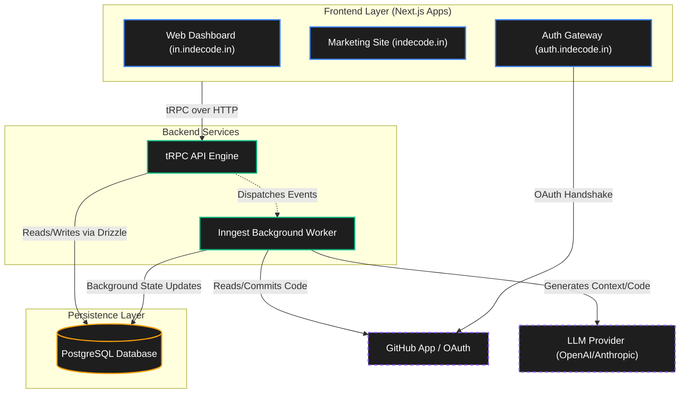

# Indecode

> Build software at the speed of thought.

[](https://indecode.in)  
[](https://drive.google.com/drive/folders/1a9HrcTVykX-f4mU2g2LB7Kz5CRUB2zq3?usp=sharing)

---

## Overview

Indecode is a production-grade, autonomous AI software development platform built explicitly for modern engineering teams, startups, and enterprise environments. It bridges the critical gap between raw product requirements and deployable code. Rather than acting as a simple auto-complete tool or a basic chat interface, Indecode functions as an autonomous agentic worker that integrates directly into your repository and development lifecycle.

The core philosophy behind Indecode is that writing boilerplate, scaffolding features, and manually tracking context across multiple files is low-leverage work. Engineering time is better spent on architecture, user experience, and strategic product decisions. By automating the translation of plain-english requirements into a structured Product Requirements Document (PRD), a Kanban task list, and finally into merged source code, Indecode empowers engineers and founders to ship significantly faster.

---

## Interface Preview

<table>
  <tr>
    <td></td>
    <td></td>
    <td></td>
  </tr>

  <tr>
    <td></td>
    <td></td>
    <td></td>
  </tr>

  <tr>
    <td colspan="3" align="center">
      
    </td>
  </tr>
</table>

---

## What We Do

Modern software development often suffers from tool fragmentation. Developers find themselves constantly context-switching between Jira, GitHub, local IDEs, and various AI prompt interfaces. This friction slows down execution and leads to mental fatigue.

Indecode solves this by providing a unified, autonomous pipeline where product requirements are directly translated into production-ready code. Users simply provide a high-level goal, and Indecode handles the execution layer. The platform analyzes the target repository, understands the existing architecture, and systematically implements the feature while providing real-time visibility into the process.

## Why We Are The Best

Most AI coding assistants rely on isolated chat windows or basic IDE autocomplete. They lack the architectural awareness to execute end-to-end features autonomously. Indecode takes a fundamentally different approach.

- **True Autonomy:** We do not just generate code snippets. Indecode reads your entire repository context, writes a comprehensive PRD, plans tasks on an interactive Kanban board, executes the code file by file, and ultimately creates a merge-ready GitHub Pull Request.
- **Zero-Friction User Experience:** Designed from the ground up with a premium dark-mode aesthetic, micro-animations, and domain-level state persistence. Users can start typing a feature request on the marketing landing page, seamlessly authenticate, and watch their request flow directly into their active project dashboard.
- **Asynchronous Stability:** Operating heavily on background jobs, Indecode never hangs or times out on the frontend. By leveraging Inngest for orchestration, the platform can silently process massive codebases over several minutes, streaming live status updates directly to the Next.js frontend via an interactive execution timeline.
- **Repository Integration:** Native integration with GitHub ensures that all changes are tracked, committed, and reviewed exactly as if a human engineer had submitted them.

---

## Tech Stack

Indecode is built on a bleeding-edge, highly scalable modern web architecture, utilizing the best tools in the ecosystem to ensure performance, type safety, and maintainability.

- **Monorepo Management:** Turborepo and PNPM workspace for optimized builds and shared package caching.
- **Frontend Framework:** Next.js 15+ (App Router) for Server-Side Rendering (SSR) and optimized delivery.
- **UI & Styling:** React, Tailwind CSS, Framer Motion, and Radix UI primitives.
- **Backend & API:** Node.js backend utilizing tRPC for end-to-end type safety between the client and server.
- **Database Layer:** PostgreSQL managed via Drizzle ORM, ensuring strict type definitions for the schema and migrations.
- **Authentication:** Better-Auth, utilizing GitHub as the primary OAuth provider for developer onboarding.
- **Background Orchestration:** Inngest and @inngest/ai for durable execution and managing long-running LLM processes without HTTP timeouts.
- **Deployment & CI/CD:** Dockerized microservices deployed via GitHub Actions to a VPS running Caddy as a reverse proxy.

---

## System Architecture

The Indecode platform operates on a multi-app monorepo structure. This strictly separates concerns into distinct, independently deployable applications while sharing core business logic through internal packages.



### Applications

1. **Web App (Dashboard):** 
   The core SaaS interface located at `in.indecode.in`. This Next.js application contains the primary project views, the real-time Execution Timeline, repository selection, and Kanban task boards. It serves as the control center for monitoring AI execution.

2. **Marketing Site:** 
   The highly optimized, public-facing landing page located at `indecode.in`. It handles user acquisition, feature demonstrations, waitlist signups, and initiating the onboarding funnel.

3. **Authentication Gateway:** 
   A dedicated micro-frontend running at `auth.indecode.in`. This handles all GitHub OAuth flows and onboarding steps, ensuring a centralized authentication session across all subdomains.

4. **Payment Portal:** 
   A dedicated billing interface located at `payment.indecode.in`. It integrates with Razorpay to manage Pro subscriptions and usage limits.

### Internal Packages

- **`@repo/database`:** Centralized Drizzle schema and migration scripts.
- **`@repo/trpc`:** The core backend routers, procedures, and tRPC context.
- **`@repo/ui`:** Shared React components and Tailwind configuration used across all applications.
- **`@repo/auth`:** Shared Better-Auth configuration and session management utilities.

### The Autonomous Execution Pipeline

When a user initiates a feature request, the system follows a strict, durable pipeline:

1. **Trigger Phase:** A user submits a feature request via the dashboard. A tRPC mutation securely logs the request to the PostgreSQL database with an initial status of "pending".
2. **Orchestration Dispatch:** An Inngest background event is dispatched. The HTTP request immediately returns, keeping the UI highly responsive.
3. **Repository Analysis:** The AI agent clones or analyzes the target GitHub repository, building an internal mental model of the directory structure, dependencies, and architectural patterns.
4. **PRD Generation:** The agent drafts a comprehensive Product Requirements Document outlining exactly how the feature will be implemented.
5. **Task Planning:** The PRD is broken down into a series of actionable tasks. These tasks are saved to the database and immediately appear on the user's Kanban board.
6. **Code Execution:** The agent iteratively processes the task list, generating necessary source code modifications, handling edge cases, and ensuring types are correct.
7. **Pull Request Creation:** Once all tasks are complete, the agent commits the changes and opens a GitHub Pull Request against the user's repository.
8. **Real-time Synchronization:** Throughout this entire process, the Next.js frontend utilizes React Query and tRPC polling to fetch updates, visually moving the SVG execution timeline node by node until the feature is fully shipped.

---

## Getting Started

Indecode is designed as a deployment-first SaaS product, utilizing Docker and GitHub Actions for production environments. However, the monorepo can easily be spun up locally for development, testing, and open-source contributions.

### Prerequisites

Ensure you have the following installed on your local machine before proceeding:
- Node.js (v20 or higher)
- PNPM (v9 or higher)
- A running instance of PostgreSQL (v15+)
- A GitHub OAuth Application (for authentication credentials)
- Inngest Local Dev Server (for testing background jobs)

### Installation & Setup

Follow these steps to configure the development environment:

```bash
# 1. Clone the repository
git clone https://github.com/realSUDO/indecode.git
cd indecode

# 2. Install monorepo dependencies using PNPM
pnpm install

# 3. Configure environment variables
# Copy .env.example to .env in the root directory and fill in the required keys
cp .env.example .env

# 4. Push the database schema via Drizzle ORM
pnpm --filter @repo/database db:push

# 5. Start the Turborepo development server
# This will concurrently start the web, auth, and marketing applications
pnpm dev
```

Once running, you can access the applications at the following local ports:
- Marketing: `http://localhost:3000`
- Web Dashboard: `http://localhost:3001`
- Auth Gateway: `http://localhost:3002`
- Payment Portal: `http://localhost:3003`

---

## License & Credits

Engineered with focus, precision, and an unwavering passion for developer tools. This project represents a significant leap forward in autonomous software development pipelines.

- **Author:** [Sumit Vishwkarma](https://github.com/realSUDO)
- **LinkedIn:** [linkedin.com/in/realsudo](https://linkedin.com/in/realsudo)
- **X (Twitter):** [x.com/sudo_core](https://x.com/sudo_core)

*Copyright © 2026 Indecode. All rights reserved.*